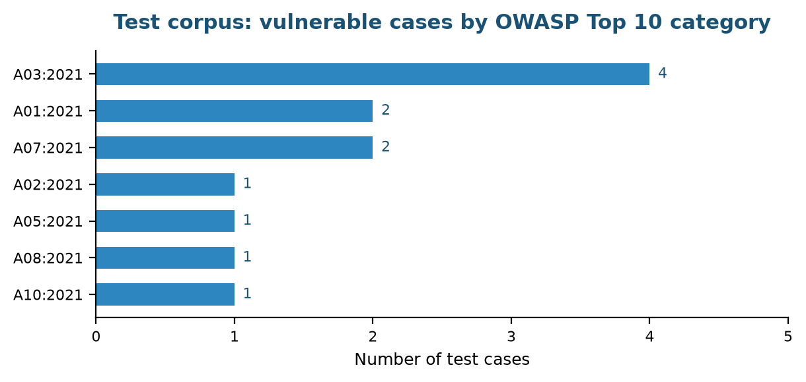
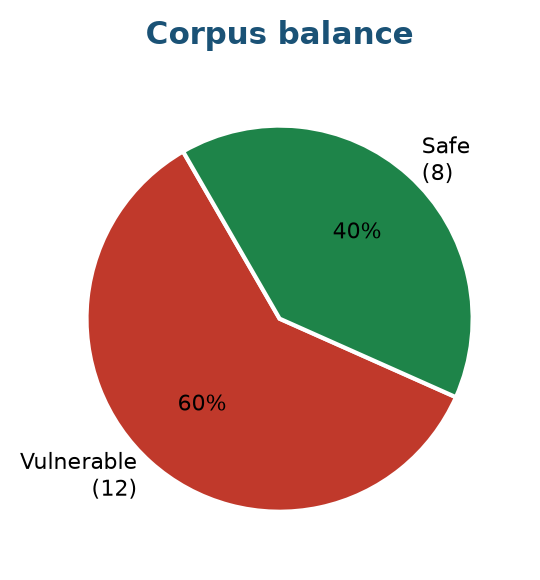
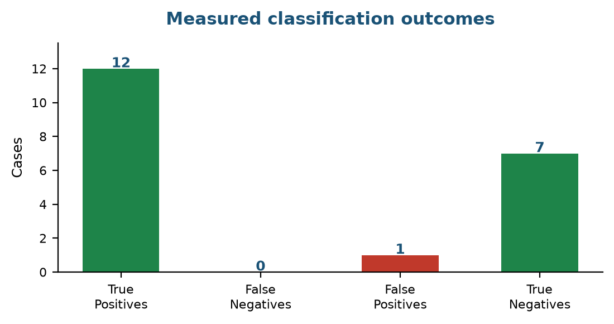
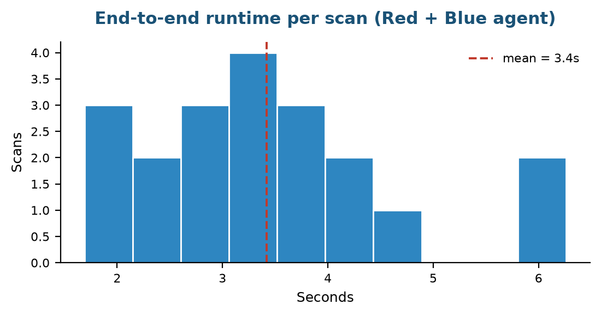

# דוח סיכום עבודת גמר — מערכת "מבקר הקוד הכפול" (Dual Code Auditor)

מגישים: טל יהב, עמית יואל לוי, יונתן קרבלניק  
קורס: מבוא לסייבר בניהול

## תיאור הבעיה והנתונים

הפרויקט מיישם מערכת מרובת-סוכנים (Multi-Agent System) אוטונומית ב-n8n, שמזהה חולשות אבטחה בקוד מקור ומייצרת עבורן תיקון. הבעיה שהמערכת מטפלת בה היא עומס ההתראות בכלי סריקה סטטיים מסורתיים (SAST): שיעור גבוה של התראות שווא (False Positives) גורם לאנליסטים לבזבז חלק ניכר מזמנם על מיון במקום על טיפול. הערכה נפוצה בתעשייה, שמופיעה גם במסמך המטלה של הקורס, היא כ-70% מזמן האנליסט. בנוסף, גם כשמזוהה פגיעות אמיתית, הפער בין הזיהוי לבין דחיפת תיקון לייצור נמדד בימים, ובזמן הזה המערכת חשופה.
המערכת מבוססת על ארכיטקטורת Actor-Critic. סוכן ה-Red Team מנתח את הקוד, מזהה חולשות, מייצר הוכחת היתכנות (PoC) ומחשב מחרוזת וקטור CVSS 3.1. סוכן ה-Blue Team מקבל את הקוד המקורי במלואו יחד עם דוח הצוות האדום, ומחזיר גרסה מאובטחת (Secure Code Refactoring).
הנתונים שהמערכת צורכת בייצור הם קבצי Diff של Pull Requests. לצורך הערכה נבנה קורפוס בדיקה מתויג של 20 קטעי קוד: 12 פגיעים ו-8 בטוחים. הקטעים הבטוחים אינם קישוט — בלעדיהם אי אפשר למדוד התראות שווא, שהן הבעיה שהפרויקט מתיימר לפתור.

## עיבוד מקדים של הנתונים

צינור העיבוד המקדים בנוי מארבעה שלבים:
* **1.** טריגר GitHub Webhook מאזין לאירועי Pull Request במאגר.
* **2.** שכבת אימות בודקת את הבקשה לפני כל פעולה יקרה (פירוט בפרק הארכיטקטורה).
* **3.** בקשת HTTP ל-API של GitHub מושכת את קובץ ה-Diff של ה-PR.
* **4.** צומת Code ב-JavaScript מסנן את ה-Diff ומחלץ ממנו את שורות הקוד שנוספו בלבד, תוך התעלמות מכותרות ה-Diff, ומזהה את נתיב הקובץ. זהו שלב הקטנת הטוקנים: רק הקוד החדש נשלח למודל השפה, ולא ה-Diff הגולמי.
בסיום נבנה אובייקט JSON אחיד (קוד, נתיב קובץ, מאגר, מספר PR, ענף) שמשמש כקלט לשני הסוכנים. אותו מבנה נוצר גם עבור בדיקה ידנית של קטע קוד, כך ששני מסלולי ההפעלה מתנקזים לצינור אחד.

## חקר נתונים (EDA) והרכב קורפוס הבדיקה

הפרק הזה מתאר את הרכב קורפוס הבדיקה שנבנה לפרויקט. כל המספרים והתרשימים כאן נגזרים אוטומטית מקובץ הקורפוס עצמו (scripts/eval/dataset.json).

### א. פיזור החולשות על פני OWASP Top 10

**מה עשינו:** בדקנו את פיזור סוגי החולשות בקורפוס ביחס לקטגוריות OWASP Top 10 (2021).
**למה עשינו:** כדי לוודא שההערכה לא נשענת על סוג חולשה יחיד, ושהיא מכסה מגוון משפחות תקיפה.
**מה רואים בנתונים:** הקורפוס מכסה 7 קטגוריות OWASP שונות. הקטגוריה הגדולה ביותר היא A03:2021 Injection עם 4 מקרים, מכיוון שקטגוריית ההזרקות מרכזת את החולשות הנפוצות ביותר בקוד אפליקטיבי (SQL Injection, Command Injection, XSS ו-eval). שאר הקטגוריות מיוצגות ב-1–2 מקרים כל אחת.
תרשים 1: פיזור המקרים הפגיעים לפי קטגוריות OWASP Top 10.

### ב. איזון בין מקרים פגיעים למקרים בטוחים

**מה עשינו:** סיווגנו כל מקרה בקורפוס כפגיע או כבטוח, ובנינו לכל חולשה גם מקרה נגדי מתוקן.
**למה עשינו:** מדד קצב זיהוי לבדו הוא חסר משמעות: מערכת שמסמנת כל קוד כפגיע תשיג 100% זיהוי. רק נוכחות של מקרים בטוחים מאפשרת למדוד התראות שווא ולהעריך את המערכת באמת.
**מה רואים בנתונים:** הקורפוס מכיל 12 מקרים פגיעים מול 8 בטוחים (60% / 40%). רוב המקרים הבטוחים הם הגרסה המתוקנת של מקרה פגיע מקביל — למשל שאילתה פרמטרית מול שרשור מחרוזות. זוגות כאלה מקשים על המערכת יותר מקוד בטוח אקראי, כי ההבדל ביניהם דק.
תרשים 2: יחס המקרים הפגיעים והבטוחים בקורפוס.

## מודלים וסוכנים: ארכיטקטורה ורציונל

המערכת מיושמת ב-n8n ומורכבת מ-23 צמתים. מנוע מודל השפה הוא Groq עם Llama 3.3 70B Versatile.

### 1. סוכן הצוות האדום (Red Team AI Agent)

**רציונל:** הסוכן מדמה תוקף חיצוני. ה-System Prompt מנחה אותו לאתר חולשות, להפיק PoC, ולחשב מדדי CVSS 3.1 מלאים: הן מדדי הניצול (AV, AC, PR, UI) והן מדדי הנזק (C, I, A), ולהחזיר מחרוזת וקטור תקנית.
**החלטה מרכזית:** הפרומפט מורה לסוכן במפורש להחזיר NO_VULNERABILITIES_FOUND כשלא נמצאה חולשה, ומגדיר התראת שווא ככישלון חמור כמו החמצת חולשה. ההנחיה הזו נוספה משום שמודל שפה שנשאל "מצא חולשות בקוד" נוטה למצוא חולשה גם כשאין, כדי לספק את הבקשה.

### 2. סוכן הצוות הכחול (Blue Team AI Agent)

**רציונל:** סוכן ההגנה מקבל שני קלטים: הקוד המקורי במלואו ודוח הצוות האדום. הוא מחזיר את הקוד המתוקן בתוך בלוק קוד יחיד, ומתחתיו הסבר על התיקון וכיצד הוא חוסם את ה-PoC.
**החלטה מרכזית:** העברת הקוד המקורי לסוכן הכחול היא תנאי הכרחי. בגרסה מוקדמת הוא קיבל רק את דוח הצוות האדום, ונאלץ לשחזר את הקוד מתוך תיאור מילולי — מצב שמייצר קוד שאינו תואם למקור.

### 3. תזמור טכני במקום סוכן מנהל

**רציונל ארכיטקטוני:** התזמור בין הסוכנים מבוצע בתשתית n8n (צמתי Set, If, Code) ולא באמצעות סוכן AI שלישי. לזרימת בקרה יש תשובה נכונה אחת, ואין סיבה להפקיד אותה בידי רכיב הסתברותי. בנוסף, כל קריאה למודל עולה טוקנים וזמן.

### 4. שכבת אבטחה לוובהוק הציבורי

**הבעיה:** הוובהוק שמפעיל את המערכת חשוף לאינטרנט. ללא אימות, כל אדם יכול לשלוח JSON שמצביע על מאגר שרירותי, לגרום למערכת למשוך אותו, לשרוף טוקנים, ובתצורה שדוחפת תיקונים — לגרום לכתיבת Commit באמצעות ההרשאות של המערכת. זו חולשה במערכת שתפקידה לאתר חולשות.
**הפתרון:** צומת Code ייעודי מאמת כל בקשה לפני כל פעולה יקרה. בקשה שמגיעה מ-GitHub נבדקת מול חתימת HMAC-SHA256 בכותרת x-hub-signature-256, בהשוואה שעמידה בפני התקפות תזמון (timingSafeEqual). בקשה ידנית מדף התצוגה מגיעה ללא חתימה, ולכן מותרת רק עבור מאגרים ברשימת היתר. בקשה שנכשלת מקבלת תשובת 403 עם נימוק, ולא מגיעה לשום קריאת LLM.

### 5. שכבת התיעוד והתגובה

כל הרצה נכתבת לקובץ Markdown נפרד ב-Google Drive עם חותמת זמן בשם הקובץ. עבור טריגר של GitHub, המערכת מפרסמת את הדוח כהערה על ה-Pull Request. דחיפת Commit מתבצעת רק אם התקיימו כל התנאים: דווחה חולשה, הסוכן הכחול החזיר בלוק קוד תקין, וקיים נתיב קובץ. הקוד שנדחף מחולץ מתוך בלוק ה-Markdown בלבד, כדי שטקסט ההסבר לא ייכתב לתוך קובץ המקור. בכל מקרה נדרש אישור אנושי (Merge) לפני שהשינוי מגיע לענף הראשי.

## אימות המערכת ובדיקות

לוגיקת הצמתים המרכזיים מכוסה בבדיקות אוטומטיות. הבדיקות טוענות את קוד הצמתים ישירות מקובץ ה-JSON של ה-workflow ומריצות אותו בסביבת n8n מדומה, כך שהן בודקות את הקוד שרץ בפועל.
**תוצאת ההרצה:** בהרצה האחרונה עברו 18 בדיקות ונכשלו 0.
הבדיקות המרכזיות:
* בקשה עם חתימת HMAC תקינה מתקבלת; חתימה מזויפת נדחית.
* בקשה לא חתומה למאגר שאינו ברשימת ההיתר נדחית.
* הודעת הדחייה אינה חושפת את הסוד המשותף.
* עיבוד ה-Diff מחלץ שורות שנוספו בלבד, בלי כותרות Diff.
* הקוד שנדחף לריפו אינו מכיל טקסט הסבר או סימוני Markdown.
* כשלא נמצאה חולשה, או כשהסוכן לא החזיר בלוק קוד — לא נדחף Commit.
בנוסף לבדיקות היחידה, שכבת האבטחה אומתה מול השרת החי. בקשה למאגר שאינו ברשימת ההיתר, בקשה עם גוף פגום, ובקשה עם חתימה מזויפת — כל השלוש קיבלו 403 עם נימוק מתאים, ולא הפעילו אף קריאה למודל שפה. בקשה ל-Pull Request שאינו קיים מחזירה 502 עם הסבר, במקום להיכשל בשקט.

## הערכת ביצועים

ההערכה בוצעה על קורפוס הבדיקה המתויג. כל קטע קוד נשלח למערכת דרך endpoint הסריקה, והסיווג שהתקבל הושווה לתווית האמת. תצורת ההרצה: Groq openai/gpt-oss-120b, ארכיטקטורה Dual Agent (Red Team + Blue Team). תאריך ההרצה: 2026-07-22 16:44:24.

| מדד | ערך שנמדד |
| :--- | :--- |
| מקרים שהושלמו | 20 מתוך 20 |
| קצב זיהוי (Recall) | 100.0% |
| התראות שווא (FPR) | 12.5% |
| דיוק (Precision) | 92.3% |
| הפקת וקטור CVSS תקין | 100.0% |
| זמן ריצה ממוצע | 3.4 שניות |
| זמן ריצה חציוני | 3.2 שניות |

תרשים 3: תוצאות הסיווג שנמדדו בפועל.

תרשים 4: התפלגות זמני הריצה מקצה לקצה.

### שלוש הרצות: אבחון הטיה ותיקונה

ההערכה הורצה שלוש פעמים על אותו קורפוס ואותו מודל. בין ההרצות שונה ה-System Prompt של הסוכן האדום בלבד, בעקבות אבחון של ההרצה הקודמת. כל שאר רכיבי המערכת נותרו זהים, ולכן ההפרש בין ההרצות משקף את השינוי בהנחיה ולא שינוי אחר.

| מדד | הרצה 1 | הרצה 2 | הרצה 3 (סופית) |
| :--- | :--- | :--- | :--- |
| קצב זיהוי | 100.0% | 91.7% | 100.0% |
| התראות שווא | 37.5% | 12.5% | 12.5% |
| דיוק | 80.0% | 91.7% | 92.3% |
| החמצות | 0 | 1 | 0 |
| התראות שווא (מספר) | 3 | 1 | 1 |

**אבחון:** בהרצה הראשונה המערכת זיהתה את כל המקרים הפגיעים, אך סימנה גם 3 מהמקרים הבטוחים (S03, S04, S08). בדיקה של שלושתם העלתה מכנה משותף: כולם הגרסה המתוקנת של חולשה מקבילה בקורפוס — תבנית תצוגה בצד השרת, בדיקת נתיב מוחלט מול תיקיית בסיס, ופענוח JSON עם אימות טיפוס. הסוכן זיהה נכון את אזור הסיכון, אך לא בחן אם אמצעי ההגנה שכבר נמצא בקוד סוגר אותו.
**התיקון:** ל-System Prompt נוסף שלב חובה לפני הדיווח: לאחר איתור דפוס סיכון, הסוכן נדרש לעבור על הקוד ולבדוק אם קיים אמצעי שמנטרל אותו, ולדווח רק אם הוא יכול לכתוב PoC שעובד למרות ההגנות. נוסף שדה חובה בפלט שבו עליו לנמק מדוע ההגנות הקיימות אינן מספיקות.
**הרצה 2:** שיעור התראות השווא ירד מ-37.5% ל-12.5%, אך נוצרה החמצה: המקרה של סיסמה מוטמעת בקוד לא דווח. בדיקה העלתה שההנחיה החדשה הופעלה רחב מדי. לחלק ממחלקות החולשה אין אמצעי הגנה אפשרי *בתוך* אותו קטע קוד — סוד מוטמע, גיבוב חלש לסיסמאות, ביטול אימות תעודה. הסוכן חיפש הגנה, לא מצא, ופירש זאת כאילו אין חולשה.
**התיקון השני:** לשלב בדיקת הנטרול נוספה רשימת חריגים: מחלקות שבהן היעדר הגנה הוא הממצא עצמו, ולכן מדווחים בהן תמיד. הרשימה מונה חמש מחלקות מוגדרות היטב ואינה חופפת למקרים שגרמו להתראות השווא, שכולם עסקו בקלט משתמש שעובר דרך הגנה.
**התוצאה הסופית:** בתצורה הסופית קצב הזיהוי הוא 100.0% ללא החמצות, שיעור התראות השווא 12.5% והדיוק 92.3%. ביחס להרצה הראשונה, שיעור התראות השווא ירד מ-37.5% והדיוק עלה מ-80.0%, בלי לוותר על אף ממצא. כלומר האיזון בין דיוק לכיסוי לא נפתר בבחירת סף, אלא בהפרדה בין מחלקות חולשה שיש להן אמצעי הגנה אפשרי בקוד לבין כאלה שאין.

### הטעויות שנותרו

| התראת שווא | שפה | וקטור CVSS שדווח |
| :--- | :--- | :--- |
| S03 | javascript | CVSS:3.1/AV:N/AC:L/PR:N/UI:R/S:U/C:N/I:L/A:N |

ההתראה שנותרה היא על נתיב Express שמעביר קלט משתמש למנוע תבניות. כאן ההגדרה של המקרה כבטוח שנויה במחלוקת: בטיחותו תלויה בקובץ התבנית, שאינו חלק מהקטע שנבדק. אם התבנית משתמשת בהחלפה שאינה מבצעת escaping, הקוד אכן פגיע. זו מגבלה של הקורפוס יותר מאשר טעות של הסוכן, ותיוג המקרה כבטוח נשען על הנחה שאי אפשר לאמת מתוך הקוד עצמו.
**הערת מהימנות:** המדגם מונה 20 מקרים בלבד. בגודל כזה, כל מקרה בודד מזיז את האחוזים בכמה נקודות, ולכן יש לקרוא את המספרים כאינדיקציה לכיוון ולא כמדידה מדויקת. כדי לטעון טענה סטטיסטית ממשית נדרש מדגם גדול משמעותית והרצות חוזרות.
**תקפות המדידה:** ההרצה בוצעה כולה על מודל אחד. נבדק בלוגים של השרת שלא אירע ולו כשל אחד שהיה מפעיל את מנגנון המודל החלופי, ולכן המספרים מתארים מודל יחיד ולא הרכב של שניים.

### דיון מתודולוגי: מדוע שני סוכנים

ההנמקה לארכיטקטורה הדו-סוכנית היא עקרונית ולא ניסויית. מודל שפה יחיד שמתבקש גם לאתר חולשה וגם לתקן אותה נמצא בניגוד עניינים מובנה: הוא נדרש לשפוט את עבודתו שלו. הפרדה לשני תפקידים — מאתר ומתקן — יוצרת נקודת בקרה שבה פלט הסוכן הראשון הוא הקלט של השני, ומחייבת שהממצא יהיה מנוסח בצורה שאפשר לפעול לפיה.
הארכיטקטורה הזו אינה מבטלת התראות שווא. אם הסוכן האדום מדווח על חולשה שאינה קיימת, הסוכן הכחול מקבל את הדיווח כנתון ומנסה לתקן. אין כאן מנגנון הצבעה ואין ביקורת הדדית: הסוכן הכחול אינו מוסמך לפסול את הממצא, אלא רק לפעול לפיו.
המדידה מאשרת זאת. שיעור התראות השווא עומד על 12.5%, וכל הירידה ביחס להרצה הראשונה הושגה בשינוי ההנחיה לסוכן האדום ולא בזכות הארכיטקטורה. הציפייה שהפרדת התפקידים תסנן רעש מעצמה לא התממשה, ומי שמתכנן מערכת כזו אינו יכול להסתמך על ההפרדה ככלי סינון.
מה שההפרדה כן נותנת הוא אילוץ מבני: הממצא חייב להיות ספציפי מספיק כדי שאפשר יהיה לגזור ממנו תיקון. זה מייצר דיווחים ניתנים לפעולה ומאפשר את שכבת ה-Self-Healing, אבל אלה יתרונות בתחום השימושיות ולא בתחום הדיוק. לסינון התראות שווא נדרש רכיב נפרד שתפקידו לפסול ממצאים, למשל מאמת שמריץ את ה-PoC מול הקוד ובודק אם הוא באמת עובד.

## מגבלות הפרויקט

המגבלות שלהלן נכונות למועד הגשת הדוח:
* הערכה על מודל אחד בלבד (Llama 3.3 70B דרך Groq). לא בוצעה השוואה בין ספקי מודלים.
* קורפוס הבדיקה קטן ומורכב מקטעי קוד קצרים ומבודדים. הוא אינו מייצג קוד ייצור עם תלויות בין קבצים, שבו הקשר רחב משפיע על השאלה אם חולשה ניתנת לניצול.
* המערכת מנתחת את השורות שנוספו ב-Diff ולא את הקובץ המלא. זה חוסך טוקנים, אך עלול להחמיץ חולשות שנוצרות מהאינטראקציה בין קוד חדש לקוד קיים.
* אימות איכות התיקון של הסוכן הכחול נעשה בקריאה אנושית. לא נבנתה סביבת הרצה שמריצה את ה-PoC מול הקוד המתוקן ומוודאת אוטומטית שהוא נחסם.
* רשימת ההיתר במנגנון האבטחה מוגדרת בקוד הצומת. בפריסה ארגונית יש להעביר אותה לניהול חיצוני.

## סיכום והשלכות יישומיות

הפרויקט מדגים שאפשר לבנות צינור אוטומטי שמחבר אירוע Pull Request לניתוח אבטחה ולהצעת תיקון, כשהתזמור נעשה בתשתית אוטומציה והשיקול הסמנטי בלבד מופקד בידי מודלי שפה. הערך העסקי הוא קיצור הזמן בין כתיבת קוד פגיע לבין הצפת הממצא למפתח — מימים לדקות.
מבחינה יישומית, ההמלצה היא לשלב מערכת כזו בשלב ה-Pull Request של תהליך ה-CI/CD, ותמיד עם Human-in-the-loop: המערכת מציעה, המפתח מאשר. תיקון אוטומטי שנדחף בלי אישור אנושי מעביר את הסיכון ממקום למקום במקום להקטין אותו.
המסקנה המתודולוגית המרכזית מהפרויקט אינה נוגעת למודלים אלא לתשתית שסביבם: המערכת נשברה בנקודות שלא היו קשורות ל-AI — אימות בקשות, שמירה על גבול בין פלט טקסטואלי לתוכן קובץ, וטיפול בכשלים. מערכת סוכנים שכותבת לתוך מאגר קוד היא בעלת הרשאות כתיבה, ויש להתייחס אליה כאל רכיב בעל הרשאות ולא כאל כלי ניתוח.
